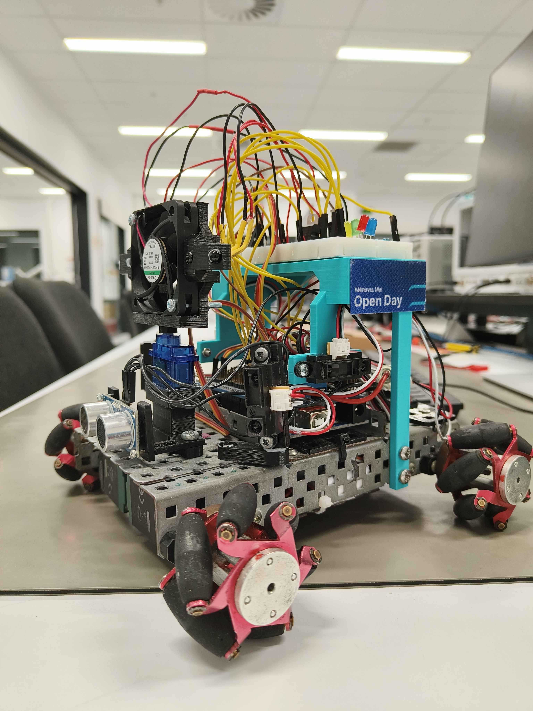
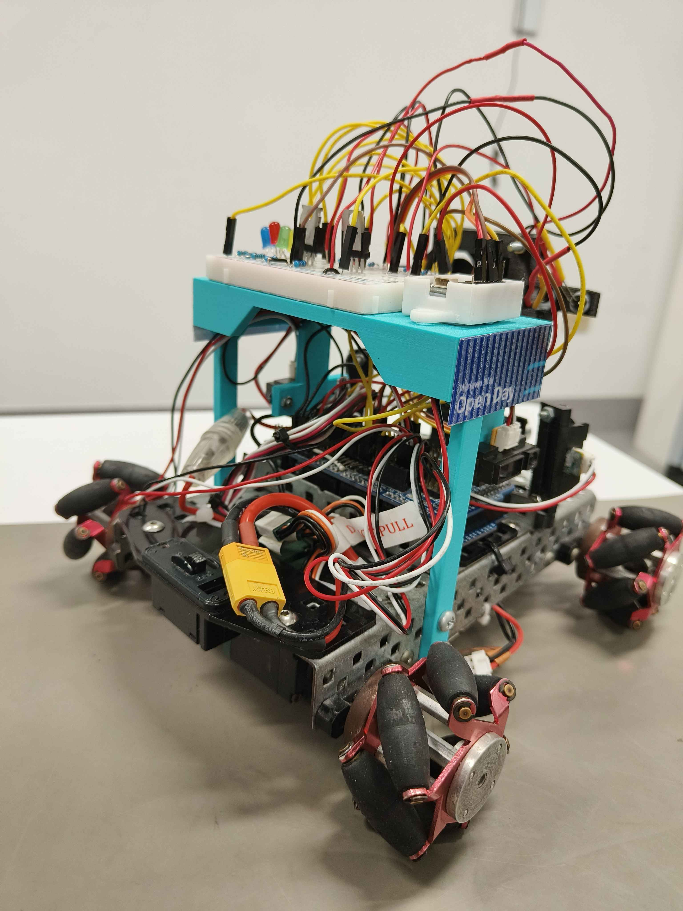
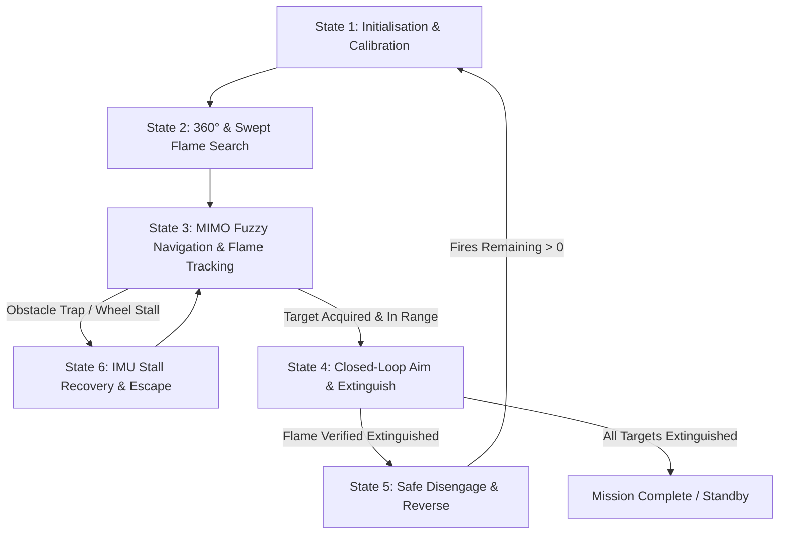
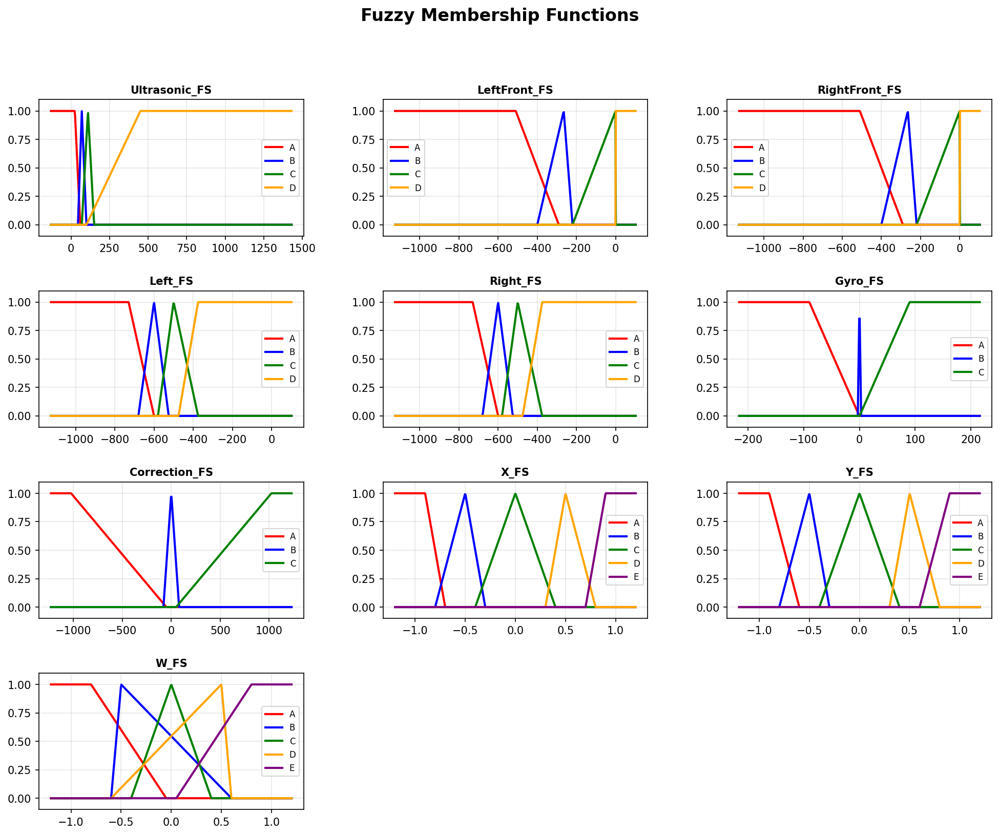

# Autonomous Fire-Extinguishing Robot

[](https://en.wikipedia.org/wiki/C%2B%2B)
[](https://www.arduino.cc/)
[](https://www.auckland.ac.nz/)
[-brightgreen.svg)](#competition--benchmark-performance)

An autonomous, holonomic mobile robot engineered for real-time environment navigation, dynamic obstacle avoidance, optical flame localization, and target extinguishing. Developed as part of the **MECHENG 706** (Mechatronics Systems) curriculum at the **University of Auckland**.

> **Achievement:** This robot was the **only entry in the cohort to achieve a 100% score across all benchmark evaluation runs**, demonstrating complete reliability in flame detection speed, navigation accuracy, obstacle clearance, and target extinguishing.

---

## 📷 Robot Overview

<p align="center">
  
  
</p>

### 🎬 Autonomous Benchmark Run Demo

> *Click to view the full autonomous run video: [figures/RobotTestRun.mp4](figures/RobotTestRun.mp4)*

<p align="center">
  <video src="figures/RobotTestRun.mp4" width="100%" controls poster="figures/RobotMainView.jpg">
    Your browser does not support the video tag. View the demo video in <a href="figures/RobotTestRun.mp4">figures/RobotTestRun.mp4</a>.
  </video>
</p>

---

## 🧠 Core Engineering & Systems Architecture



### 1. 4-Wheel Holonomic Drive & Kinematics Engine
The chassis utilizes a 4-wheel omnidirectional configuration to achieve unconstrained 3-DOF planar motion (independent translation in $x, y$ and rotation $\omega$).

- **Inverse Kinematics Formulation:**
  $$\begin{bmatrix} \dot{\theta}_1 \\ \dot{\theta}_2 \\ \dot{\theta}_3 \\ \dot{\theta}_4 \end{bmatrix} = \frac{1}{R_w} \begin{bmatrix} 1 & 1 & -(L + l) \\ 1 & -1 & (L + l) \\ 1 & -1 & -(L + l) \\ 1 & 1 & (L + l) \end{bmatrix} \begin{bmatrix} \dot{x} \\ \dot{y} \\ \omega \end{bmatrix}$$
  *Parameters:* Wheel radius $R_w = 30\,\text{mm}$, half-wheelbase length $L = 105\,\text{mm}$, half-track width $l = 90\,\text{mm}$.
- **Decoupled Kinematics (`moveDirectionCapX`):** Preserves prioritized lateral avoidance ($y$) and angular correction ($\omega$) by dynamically recalculating forward velocity headrooms within $[\pm 500]$ motor PWM bounds.
- **Dynamic Drift Compensation & Deadband Handling:** Closed-loop non-linear friction break-away thresholds ($\ge 85\,\text{PWM}$) and heading cross-coupling compensators ensure straight-line fidelity.

---

### 2. Multi-Input Multi-Output (MIMO) Fuzzy Logic Controller
Reactive obstacle avoidance and path planning are governed by a C++ fuzzy inference system (`FuzzyLogic`) calculating exact analytical centroids.

<p align="center">
  
</p>

- **Fuzzification:** 5 input linguistic variables across 17 membership sets:
  - Ultrasonic Front Distance ($Z, S, \text{Triangular}$)
  - Left / Right Short-Range IR ($Z, S, \text{Triangular}$)
  - Front-Left / Front-Right Long-Range IR ($Z, S, \text{Triangular}$)
  - Gyro Heading Error & Phototransistor Differential Corrections
- **Analytical Defuzzification:** Real-time geometric centroid computation $\left(\frac{\sum u_i \cdot A_i}{\sum A_i}\right)$ evaluating exact trapezoid/triangle integration without discrete numerical lookup tables.
- **Rule Aggregation:** Smoothly balances aggressive lateral wall bypassing against continuous optical flame attraction.

---

### 3. Sensor Fusion & Digital Signal Processing
- **BNO08x 9-DOF Intelligent IMU:** Tracks continuous 3D game rotation vectors (`SH2_GAME_ROTATION_VECTOR`) with quaternion-to-Euler yaw extraction and phase unwrapping for drift-free heading reference.
- **4-Channel Infrared Rangefinder Array:** Combines analog GP2Y0A21YK0F and GP2Y0A41SK0F sensors calibrated with power-law voltage-to-distance transforms:
  $$\text{Distance} = C \cdot V^{\gamma} - d_{\text{shift}}$$
- **Phototransistor Target Array:** 4-channel analog optical detector array configured for flame triangulation and differential tracking.
- **First-Order Recursive Low-Pass Filtering:**
  $$y_k = y_{k-1} + K \cdot (x_k - y_{k-1}), \quad K = \frac{P}{P + Q}$$
  Mitigates noise and ambient light flicker across all high-speed telemetry channels.

---

### 4. Robust 6-Stage Finite State Machine (FSM)
The autonomous executive loop (`FSM`) provides deterministic state handling with built-in fault tolerance:

| State | Name | Functional Description |
|---|---|---|
| **1** | **Initialisation** | Sensor zeroing, digital filter seeding, and IMU baseline gyro calibration. |
| **2** | **Search** | Bidirectional $150^\circ$ servo sweep coupled with $120^\circ$ yaw rotations to detect optical flame signatures. Rejects false-positives via peak irradiance filtering. |
| **3** | **Move / Track** | Fuses MIMO fuzzy avoidance with differential flame heading vectors. Includes a persistent lateral wall-bypass latch for escaping concavities. |
| **4** | **Extinguish** | Motion-locks the drive base, performs closed-loop pan servo alignment, conducts safety proximity confirmation, and activates the high-flow fan until optical feedback confirms extinction ($< 10$ ADC threshold). |
| **5** | **Reverse** | Controlled recoil and sensor re-sampling maneuver prior to searching for secondary targets. |
| **6** | **Stall Recovery** | Detects stationary IMU yaw patterns during commanded turns/translations; executes multi-axis un-wedging sequences (lateral strafe + reverse). |

---

## 🛠️ Hardware Specification & Pin Interface

| Subsystem | Component | Interface / Pin Mapping |
|---|---|---|
| **MCU** | Arduino Mega 2560 (ATmega2560) | Main On-Board Controller |
| **Drive Motors** | 4x Continuous DC Geared Motors | Pins `46` (FL), `51` (FR), `47` (RL), `50` (RR) |
| **Extinguisher** | High-RPM Centrifugal Fan + Servo Mount | Fan Pin `45` (PWM/Digital), Servo Pin `9` |
| **IMU** | BNO080 / BNO085 9-DOF Sensor | I2C (`SDA` / `SCL`, 100 Hz SH2 Reports) |
| **Ranging (Sonar)** | HC-SR04 Ultrasonic Sensor | Trigger: `48`, Echo: `49` |
| **Ranging (IR)** | 4x Sharp Distance Sensors (Long/Short) | Pins `A8` (FL), `A9` (L), `A10` (R), `A11` (FR) |
| **Optical Sensors** | 4x Phototransistor Array | Pins `A2` (Far-L), `A3` (Mid-L), `A6` (Mid-R), `A5` (Far-R) |
| **Diagnostics** | RGB Status Indicator + Bluetooth UART | LEDs `Pin 13` / `Pin 12` / `Pin 11`, Serial Bluetooth |

---

## 📁 Repository Structure

```text
├── fire-extinguishing-robot.ino   # Main embedded setup and loop entry point
├── figures/                       # Demonstration videos, photos, and performance plots
│   ├── RobotMainView.jpg          # Isometric front photograph
│   ├── RobotBackView.jpg          # Rear subsystem photograph
│   ├── RobotTestRun.mp4           # 100% benchmark evaluation run recording
│   └── fuzzy_membership_*.png    # Generated fuzzy logic membership curves
└── src/
    ├── Actuators/                 # Actuator drivers (Motors, Fan, FanServo)
    ├── Sensors/                   # Sensor abstractions (BNO08x Gyro, IR, Sonar, Phototransistors)
    ├── Robot/
    │   ├── Control/               # Kinematics, trajectory generation, and aiming routines
    │   │   └── Fuzzy/             # Analytical MIMO Fuzzy Logic Inference Engine
    │   ├── FSM/                   # 6-State Autonomous Finite State Machine & Stall Watchdog
    │   └── Robot.cpp              # Hardware aggregation layer
    └── Misc/                      # Fast math helpers, digital filters, and telemetry tools
```

---

## 🚀 Building & Flashing

1. **Prerequisites:**
   - [Arduino IDE](https://www.arduino.cc/en/software) or [PlatformIO / Arduino-CLI](https://platformio.org/)
   - Target Board: **Arduino Mega 2560**
   - Libraries: `Adafruit BNO08x`, `Wire`, `Servo`
2. **Compile and Upload:**
   ```bash
   # Using Arduino CLI:
   arduino-cli compile --fqbn arduino:avr:mega fire-extinguishing-robot.ino
   arduino-cli upload -p <PORT> --fqbn arduino:avr:mega fire-extinguishing-robot.ino
   ```
3. **Telemetry & Calibration:**
   Open the Bluetooth/Serial terminal at `115200 baud` to view real-time state machine transitions, filtered IR/Sonar readings, and PID/Fuzzy output telemetry.

---

## 🏆 Competition & Benchmark Performance

- **Course:** MECHENG 706 (Mechatronics Systems), Department of Mechanical & Mechatronics Engineering, The University of Auckland.
- **Outcome:** **100% Benchmark Completion Rate** across all obstacle configurations and flame placement variations.
- **Key Differentiator:** The combination of true holonomic kinematics, custom continuous centroid fuzzy logic, and real-time optical closed-loop extinguishing eliminated blind spots and prevented deadlocks common in conventional differential-drive solutions.
